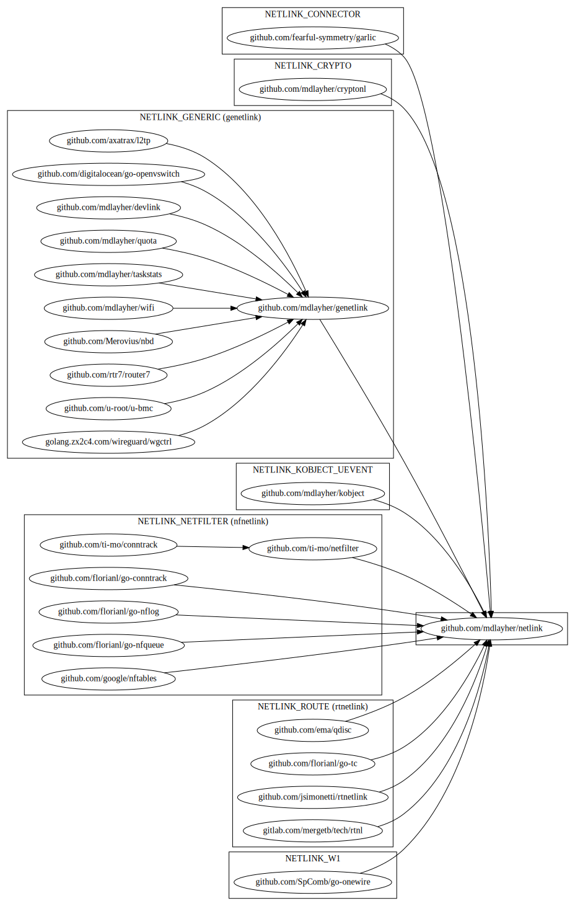

# netlink   

Package `netlink` provides low-level access to Linux netlink sockets.
MIT Licensed.

For more information about how netlink works, check out my blog series
on [Linux, Netlink, and Go](https://mdlayher.com/blog/linux-netlink-and-go-part-1-netlink/).

If you have any questions or you'd like some guidance, please join us on
[Gophers Slack](https://invite.slack.golangbridge.org) in the `#networking`
channel!

## Stability

See the [CHANGELOG](./CHANGELOG.md) file for a description of changes between
releases.

This package has a stable v1 API and any future breaking changes will prompt
the release of a new major version. Features and bug fixes will continue to
occur in the v1.x.x series.

The general policy of this package is to only support the latest, stable version
of Go. Compatibility shims may be added for prior versions of Go on an as-needed
basis. If you would like to raise a concern, please [file an issue](https://github.com/mdlayher/netlink/issues/new).

**If you depend on this package in your applications, please use Go modules.**

## Design

A [number of netlink packages](https://godoc.org/?q=netlink) are already
available for Go, but I wasn't able to find one that aligned with what
I wanted in a netlink package:

- Straightforward, idiomatic API
- Well tested
- Well documented
- Doesn't use package/global variables or state
- Doesn't necessarily need root to work

My goal for this package is to use it as a building block for the creation
of other netlink family packages.

## Ecosystem

Over time, an ecosystem of Go packages has developed around package `netlink`.
Many of these packages provide building blocks for further interactions with
various netlink families, such as `NETLINK_GENERIC` or `NETLINK_ROUTE`.

To have your package included in this diagram, please send a pull request!

